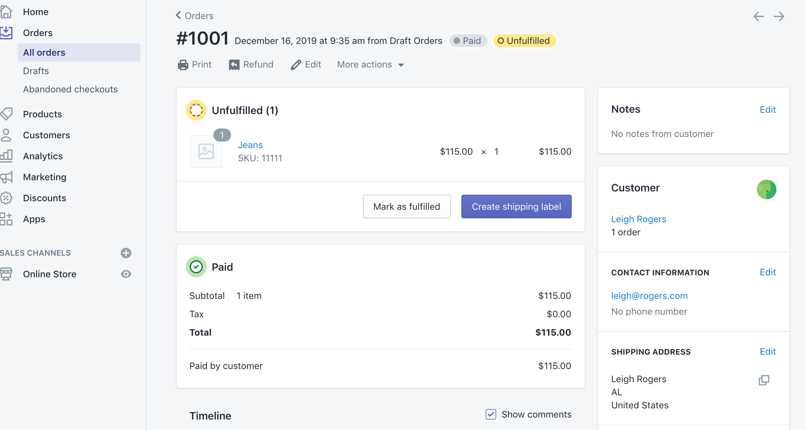
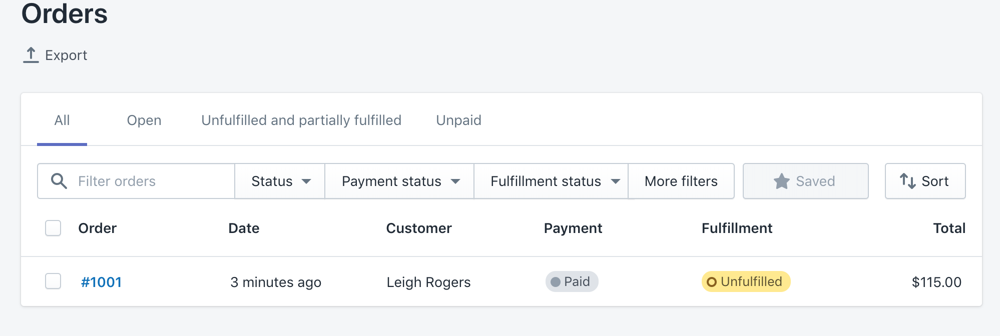
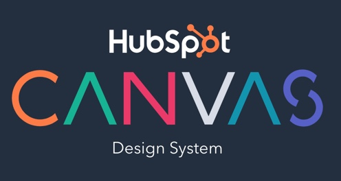
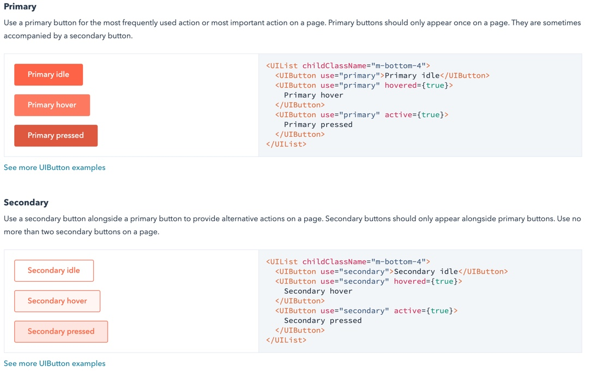
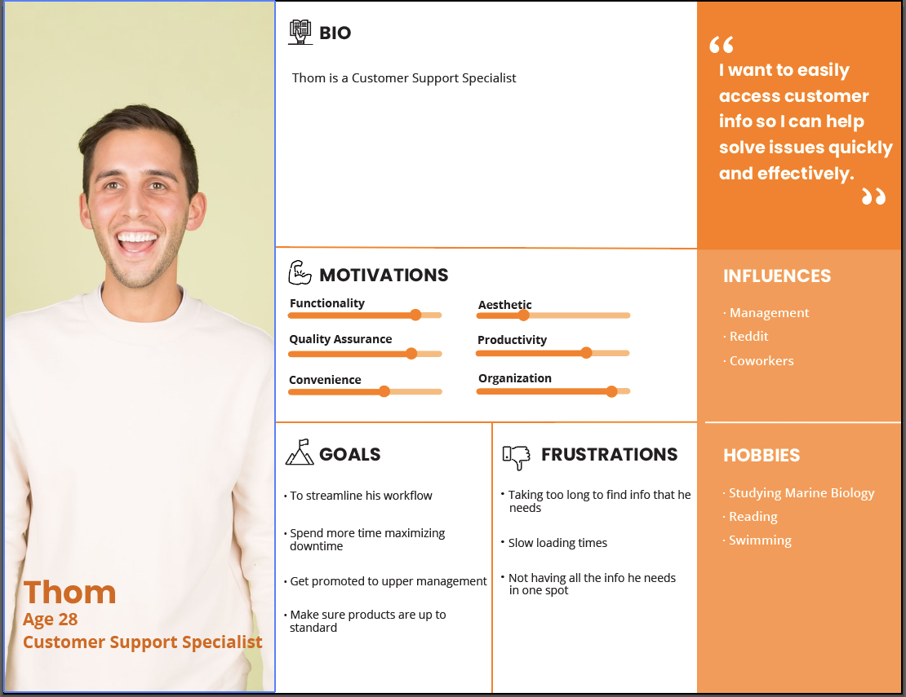

# Bang-A-Zon
## We sell aquariums and aquarium related accessories. Ah-yup. I tehell you huwhat.

## Project Overview
We were tasked creating a company intranet website for an Esty-esque marketplace. We consulted with our stakeholders Madi and Adam to determine the functionality/requirements. We split into two teams to tackle the two major components of the intranet site: Employee and Customer.

## Challenge Statement
### Employee
##### How might we ... provide a centralized platform to track and manage Bangazon employee information?

### Customer
##### How might we create a user interface that allows Bangazon’s customer service team to easily find and manage customers’ information, orders, products, and payments in order to continue their growth and be able to support their customer base and employees?

## Research

### Competitor Analysis

### Design System (Canvas Hubspot)

https://canvas.hubspot.com/

Many of our design decisions were based on a set of guidlines gounf in the link above. For example, we could not have more than one orange button in a view at any given time, and all orange buttons were the most important action on that particular view. All other buttons that were secondary to that primary action would be the second example in the above image, and no more than two were allowed in a given view. For more information please, checkout the url above for the full documentation.

#### Color Palette
Color Palette was put together based on design guideliness dictated by the Hubspot Canvas Design System. We were able to make some decisions on themeing within the site as a visual indicator of what part of the intranet site you were on.

## Personas

## Journey Mapping

## Content Mapping

##  Wireframes and Mockups

### Paper Mockups (Lo-Fidelity)

### First round of User Testing

#### User Feedback/Lessons Learned

### Digital Mockups (Hi-Fidelity)

### Second Round of User Testing

#### User Feedback/Lessons Learned

## To Install

### TBD